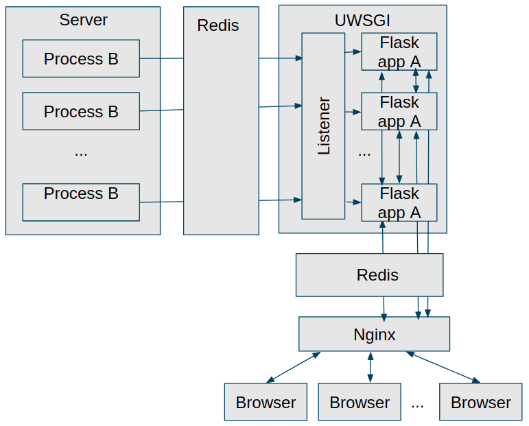

# Complex framework

###### Architecture diagram:

###### Goal:
Our goal is to send an update from any process B to the browser.

###### How to run:

* Create new virtual environment and activate it

* Install dependencies, for example: `pip install -r requirements.txt`

* Install redis server (you can use instructions here: https://redis.io/topics/quickstart)

* Run locally:
    * Run a redis server on host 127.0.0.1 and port 6379:6379. For example: `redis-server`

    * Run the uwsgi server: `uwsgi --ini uwsgi.ini`

* Or run with docker compose:

`docker build -t complex_example .`

`docker-compose -f docker-compose.yml -f docker-compose.yml up -d`

Note: Tested on Redis server version 6.2.1 and 4.0.9. 

###### Usage:

* open http://127.0.0.1:8888/ on any client
